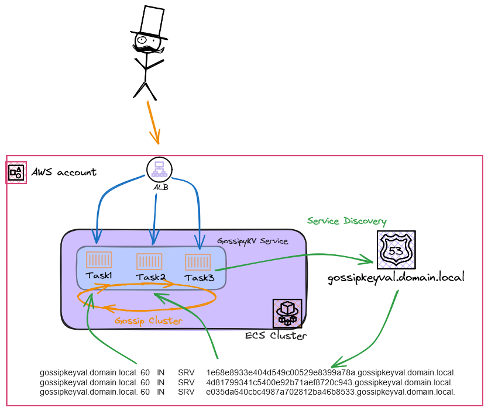

# Welcome to GossipyKV

Test Bed Project to demonstrate a cluster being stood up in ECS fargate that coordinates actions across the cluster with a gossip clustering algorithm implemented by using [memberlist](https://github.com/hashicorp/memberlist).

In this case the app in a very rough distributed eventually consistent keystore API. The application is functional but not something to be used outside a experimental context, please use something more suitable [consul](https://github.com/hashicorp/consul), [etcd](https://github.com/etcd-io/etcd) , [redis](https://github.com/redis/redis) etc

## Operation

Each of the three tasks of the cluster hosts a rest API supporting basics operations to PUT/GET/DELETE values from the the tasks local keystore ( in-memory).

REST Operations are propagated to the remaining member of the cluster using broadcast messages over a gossip protocol. Cluster members receiving the messages will replay those actions into their own keystores.

```
$ # add a value into the keystore
$curl -X PUT http://GossipyKeyValLB-1018863412.eu-west-1.elb.amazonaws.com/kv/foo/bar
{"foo":"bar"}

$ # retrieve a value from the keystore
$curl http://GossipyKeyValLB-1018863412.eu-west-1.elb.amazonaws.com/kv/foo
{"foo":"bar"}

$ # delete a value from the keystore
$curl -X DELETE http://GossipyKeyValLB-1018863412.eu-west-1.elb.amazonaws.com/kv/foo

$ # confirm the deletion
$ curl -v http://GossipyKeyValLB-1018863412.eu-west-1.elb.amazonaws.com/kv/foo
*   Trying 54.72.83.9:80...
* Connected to GossipyKeyValLB-1018863412.eu-west-1.elb.amazonaws.com (54.72.83.9) port 80 (#0)
> GET /kv/foo HTTP/1.1
> Host: GossipyKeyValLB-1018863412.eu-west-1.elb.amazonaws.com
> User-Agent: curl/7.86.0
> Accept: */*
>
* Mark bundle as not supporting multiuse
< HTTP/1.1 404 Not Found
< Date: Wed, 06 Mar 2024 2
```

## Architecture

Each task container is stood up in ECS fargate and is attached to a ALB load balancer as well as being associated with AWS cloudmap backed SRV DNS record.

On boot each task discovers their peers via the SRV record and attempts to form a cluster. Generous retries are built into the cluster formation to allow infrastructure settle and the cloudmap records to appear.



## Limitations

I would have also liked the internal solution to be a pure IPV6 stack, but ECS feels very much reliant on IPV4 to support is operations at the moment. The VPC is configured to support IPV6 operations ( including NAT64)

## Useful commands

-   `make clean` remove any intermediate state
-   `make diff` compare deployed stack with current state
-   `make deploy ` deploy this stack to your default AWS account/region
